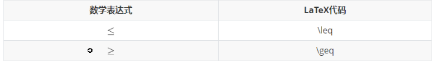

## Markdown语法中的数学公式

## 01书写形式

- 行内公式（inline）:用一对美元符号$$包裹

  ```markdown
  $$
  ```
  
- 整行公式（displayed）：用一对紧挨的两个美元符号$$$$包裹。

  ```markdown
  $$ $$
  ```

## 02字符字典

|    大写    |     Tex      |    小写    |     Tex      |
| :--------: | :----------: | :--------: | :----------: |
|    $A$     |    `$A$`     |  $\alpha$  |  `$\alpha$`  |
|    $B$     |    `$B$`     |  $\beta$   |  `$\beta$`   |
|  $\Gamma$  |  `$\Gamma$`  |  $\gamma$  |  `$\gamma$`  |
|  $\Delta$  |  `$\Delta$`  |  $\delta$  |  `$delta$`   |
|    $E$     |    `$E$`     | $\epsilon$ | `$\epsilon$` |
|    $Z$     |    `$Z$`     |  $\zeta$   |  `$\zeta$`   |
|    $H$     |    `$H$`     |   $\eta$   |   `$\eta$`   |
|  $\Theta$  |  `$\Theta$`  |  $\theta$  |  `$\theta$`  |
|    $I$     |    `$I$`     |  $\iota$   |  `$\iota$`   |
|    $K$     |    `$K$`     |  $\kappa$  |  `$\kappa$`  |
| $\Lambda$  | `$\Lambda$`  | $\lambda$  | `$\lambda$`  |
|    $M$     |    `$M$`     |   $\mu$    |   `$\mu$`    |
|    $N$     |    `$N$`     |   $\nu$    |   `$\nu$`    |
|   $\Xi$    |   `$\Xi$`    |   $\xi$    |   `$\xi$`    |
|    $O$     |    `$O$`     | $\omicron$ | `$\omicron$` |
|   $\Pi$    |   `$\Pi$`    |   $\pi$    |   `$\pi$`    |
|    $P$     |    `$P$`     |   $\rho$   |   `$\rho$`   |
|  $\Sigma$  | `$\Sigma$`  |  $\sigma$  |  `$\sigma$`  |
|    $T$     |    `$T$`     |   $\tau$   |   `$\tau$`   |
| $\Upsilon$ | `$\Upsilon$` | $\upsilon$ | `$\upsilon$` |
|   $\Phi$   |   `$\Phi$`   |   $\phi$   |   `$\phi$`   |
|    $X$     |    `$X$`     |   $\chi$   |   `$\chi$`   |
|   $\Psi$   |   `$\Psi$`   |   $\psi$   |   `$\psi$`   |
|  $\Omega$  |  `$\Omega$`  |  $\omega$  |  `$\omega$`  |

## 03常用符号的代码

### 01上下标，正负无穷

| 数学表达式 | LaTex代码   |
| ---------- | ----------- |
| $x^2$      | `$x^2$`     |
| $y_1$      | `$y_1$`     |
| $\infty$   | `$\infty$`  |
| $-\infty$  | `$-\infty$` |

### 02加减乘，分式，根号，省略号

|  数学表达式   |    LaTex代码    |
| :-----------: | :-------------: |
|   $a+b-c*d$   |   `$a+b-c*d$`   |
|  $a\div{b}$   |  `$a\div{b}$`   |
|   $a\pm{b}$   |   `$a\pm{b}$`   |
| $\frac{a}{b}$ | `$\frac{a}{b}$` |
|  $\sqrt{b}$   |  `$\sqrt{b}$`   |
|   $\cdots$    |   `$\cdots$`    |

### 03三角函数

|   数学表达式   |    LaTex代码     |
| :------------: | :--------------: |
| $\sin{\theta}$ | `$\sin{\theta}$` |
| $\cos{\theta}$ | `$\cos{\theta}$` |
| $\tan{\theta}$ | `$\tan{\theta}$` |
| $\cot{\theta}$ | `$\cot{\theta}$` |
| $\csc{\theta}$ | `$\csc{\theta}$` |

### 04矢量，累加累乘，极限

|            数学表达式             |              LaTex代码              |
| :-------------------------------: | :---------------------------------: |
|             $\vec{F}$             |             `$\vec{F}$`             |
|       $\sum_{i=1}^{n}{a_i}$       |       `$\sum_{i=1}^{n}{a_i}$`       |
|      $\prod_{i=1}^{n}{a_i}$       |      `$\prod_{i=1}^{n}{a_i}$`       |
| $\lim_{a\rightarrow+\infty}{a+b}$ | `$\lim_{a\rightarrow+\infty}{a+b}$` |

### 关系运算符



## 03矩阵

### 01简单矩阵

> 使用`\begin{matrix}…\end{matrix}`生成， 每一行以`\\`结尾表示换行，元素间以`&`间隔，式子的表示序号`\tag{1}`（右边的序号）。

$$
\begin{matrix}
1&2&3\\
4&5&6\\
7&8&9\\
\end{matrix} \tag{1}
$$

```latex
$$
\begin{matrix}
1&2&3\\
4&5&6\\
7&8&9\\
\end{matrix} \tag{1}
$$
```

### 02带左右括号的矩阵（大中小括号）

#### 方法一

> 在`\begin{}`之前和`\end{}`之后添加左右括号的代码。

**大括号：**
$$
\left\{
 \begin{matrix}
   1 & 2 & 3 \\
   4 & 5 & 6 \\
   7 & 8 & 9
  \end{matrix}
  \right\} \tag{2}
$$

```latex
$$
\left\{
 \begin{matrix}
   1 & 2 & 3 \\
   4 & 5 & 6 \\
   7 & 8 & 9
  \end{matrix}
  \right\} \tag{2}
$$
```

**中括号：**
$$
\left[
 \begin{matrix}
   1 & 2 & 3 \\
   4 & 5 & 6 \\
   7 & 8 & 9
  \end{matrix}
  \right] \tag{3}
$$

```latex
$$
 \left[
 \begin{matrix}
   1 & 2 & 3 \\
   4 & 5 & 6 \\
   7 & 8 & 9
  \end{matrix}
  \right] \tag{3}
$$
```

**小括号：**
$$
\left(
 \begin{matrix}
   1 & 2 & 3 \\
   4 & 5 & 6 \\
   7 & 8 & 9
  \end{matrix}
  \right) \tag{4}
$$

```latex
$$
 \left(
 \begin{matrix}
   1 & 2 & 3 \\
   4 & 5 & 6 \\
   7 & 8 & 9
  \end{matrix}
  \right) \tag{4}
$$
```

#### 方法二

> 改变`\begin{matrix}`和`\end{matrix}`中`{matrix}`

**大括号：**
$$
\begin{Bmatrix}
   1 & 2 & 3 \\
   4 & 5 & 6 \\
   7 & 8 & 9
  \end{Bmatrix} \tag{6}
$$

```latex
$$
 \begin{Bmatrix}
   1 & 2 & 3 \\
   4 & 5 & 6 \\
   7 & 8 & 9
  \end{Bmatrix} \tag{6}
$$
```

**中括号：**
$$
\begin{bmatrix}
   1 & 2 & 3 \\
   4 & 5 & 6 \\
   7 & 8 & 9
  \end{bmatrix} \tag{6}
$$

```latex
$$
 \begin{bmatrix}
   1 & 2 & 3 \\
   4 & 5 & 6 \\
   7 & 8 & 9
  \end{bmatrix} \tag{6}
$$
```

**小括号：**

$$
\mathbf{X} = \left(
\begin{array}{cccc}
 1 & 2 & 3 \\
   4 & 5 & 6 \\
   7 & 8 & 9
\end{array}\right)
$$

```latex
$$
\mathbf{X} = \left(
\begin{array}{cccc}
 1 & 2 & 3 \\
   4 & 5 & 6 \\
   7 & 8 & 9
\end{array}\right)
$$
```

### 03包含希腊字母与省略号

> 行省略号`\cdots`，列省略号`\vdots`，斜向省略号（左上至右下）`\ddots`。
$$
\left\{
 \begin{matrix}
 1      & 2        & \cdots & 5        \\
 6      & 7        & \cdots & 10       \\
 \vdots & \vdots   & \ddots & \vdots   \\
 \alpha & \alpha+1 & \cdots & \alpha+4
 \end{matrix}
 \right\}
$$

```latex
$$
 \left\{
 \begin{matrix}
 1      & 2        & \cdots & 5        \\
 6      & 7        & \cdots & 10       \\
 \vdots & \vdots   & \ddots & \vdots   \\
 \alpha & \alpha+1 & \cdots & \alpha+4 
 \end{matrix}
 \right\}
$$
```

## 04公式序号

> 见[“矩阵](#03矩阵)”小节，代码最后的一行即表示右端序号

```latex
......
\tag{6}
```

## 05行列式

> 行列式相关语法与矩阵类似
>
$$
\begin{vmatrix}
   1 & 2 & 3 \\
   4 & 5 & 6 \\
   7 & 8 & 9
\end{vmatrix}
\tag{7}
$$

```latex
$$
 \begin{vmatrix}
   1 & 2 & 3 \\
   4 & 5 & 6 \\
   7 & 8 & 9
  \end{vmatrix}
\tag{7}
$$
```

## 06表格

### **1.简易表格**

$$
\begin{array}{|c|c|c|}
\hline 2&9&4\\
\hline 7&5&3\\
\hline 6&1&8\\
\hline
\end{array}
$$

```latex
$$
\begin{array}{|c|c|c|}
\hline 2&9&4\\
\hline 7&5&3\\
\hline 6&1&8\\
\hline
\end{array}
$$
```

**开头结尾**：

 `\begin{array}` ， `\end{array}`

**定义式**：

例：`{|c|c|c|}`，其中`c` `l` `r` 分别代表居中、左对齐及右对齐。

**分割线**：

①**竖直分割线**：在定义式中插入 `|`， （`||`表示两条竖直分割线）。

②**水平分割线**：在下一行输入前插入 `\hline`，以下图真值表为例。

其他：每行元素间均须要插入 `&` ，每行元素以 `\\` 结尾。

### **2.真值表**

$$ \begin{array}{cc|c}        A&B&F\\ \hline 0&0&0\\        0&1&1\\        1&0&1\\        1&1&1\\ \end{array} $$

```latex
$$
\begin{array}{cc|c}
       A&B&F\\
\hline 0&0&0\\
       0&1&1\\
       1&0&1\\
       1&1&1\\
\end{array}
$$
```

## **07多行等式对齐**

$$
\begin{aligned}
a &= b + c \\
  &= d + e + f
\end{aligned}
$$

```latex
$$
\begin{aligned}
a &= b + c \\
  &= d + e + f
\end{aligned}
$$
```

## **08方程组、条件表达式**

方程组：

$$
\begin{cases}
3x + 5y +  z \\
7x - 2y + 4z \\
-6x + 3y + 2z
\end{cases}
$$

```latex
$$
\begin{cases}
3x + 5y +  z \\
7x - 2y + 4z \\
-6x + 3y + 2z
\end{cases}
$$
```

同理，条件表达式：

$$
f(n) =
\begin{cases}
n/2,  & \text{if }n\text{ is even} \\
3n+1, & \text{if }n\text{ is odd}
\end{cases}
$$

```latex
$$
f(n) =
\begin{cases} 
n/2,  & \text{if }n\text{ is even} \\
3n+1, & \text{if }n\text{ is odd}
\end{cases}
$$
```

------

## **09间隔 (大小空格、紧贴)**

**紧贴 + 无空格 + 小空格 + 中空格 + 大空格 + 真空格 + 双真空格**
$$
a\!b + ab + a\,b + a\;b + a\ b + a\quad b + a\qquad b
$$

```latex
$$
a\!b + ab + a\,b + a\;b + a\ b + a\quad b + a\qquad b
$$
```

紧贴`\!`

无空格 小空格`\,` 中空格`\;` 大空格`\`

真空格`\quad` 双真空格`\qquad`
