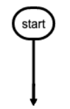

# MPE语法

```flow
st1=>start: defs.h
st2=>start: mac.h
e=>end
op1=>operation: My Operation
sub1=>subroutine: My Subroutine
cond=>condition: Yes
or No?:>http://www.google.com
io=>inputoutput: catch something...
para=>parallel: parallel tasks

(st1,st2)->para
st2->para
```

## 图像

### flowchart

#### 节点语法

定义节点的形状

- start



```markdown
st=>start:start
```

```puml


rectangle c预处理器
rectangle c编译器
rectangle linker
usecase "defs.h" as a
usecase "mac.h" as b
usecase "main.c" as c
usecase "help.c" as d
usecase "other.c" as e
usecase "main.o" as f
usecase "help.o" as g
usecase "other.o" as h
usecase "libc.a" as i
usecase "a.out" as j

a --> c预处理器
b --> c预处理器
c --> c预处理器
d --> c预处理器
e --> c预处理器
c编译器 -->f 
c编译器 -->g 
c编译器 -->h 

linker --> f
linker --> h

linker --> j
g --> linker

i --> linker
c预处理器 --> c编译器

```

## 数学

**Markdown Preview Enhanced** 使用 **KaTeX** 或者 **MathJax** 来渲染数学表达式。

KaTeX 拥有比 MathJax 更快的性能，但是它却少了很多 MathJax 拥有的特性。你可以查看 **KaTeX supported functions/symbols** 来了解 KaTeX 支持那些符号和函数。

默认下的分隔符:

- 行内显示:`$...$` 或者 `\(...\)`
- 块内显示:`$$...$$` 或者 `\[...\]`或者` ```math` 


**查看[数学文档]**

[数学文档]:https://katex.org/docs/supported.html

```math
f'(x)=x
\begin{vmatrix}
a&b\\
c&d
\end{vmatrix}
```
