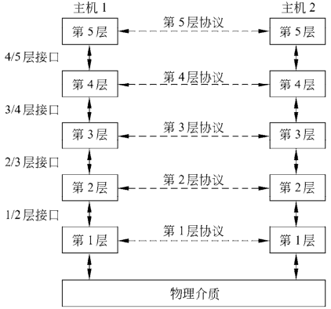
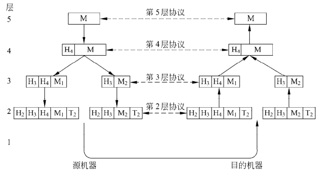

# 1.3 网络软件

> 计算机网络设计，先考虑硬件，后考虑软件。这种策略不再行得通。

## 1.3.1 协议层次结构

### 1.低网络设计的复杂性

- 组织一个**层次栈(a stack of layer)**或**分级栈(a stack of level)**
  - 解释：每一层都建立在其下一层的基础上。
  - 目的：每一层的目的是向上一层提供特定的服务。

### 2.协议(protocol)

- 指通信双方就如何通信的一种约定。

### 3. 对等体(peer)

- 不同机器上构成相应层次的实体。
- 层次、协议和接口

### 4.物理介质(physical medium)

> 即，协议第一层的下面一层。

### 5.接口（interface)

- 位置：在每一对相邻层次之间。
- 作用：定义了下层向上层提供了哪些原语操作与服务。
- 影响：接口的定义可以使网络设计者更好地规划网络中的层数以及每一层的功能。且为减少层与层之间必要传递的信息外，清晰的接口使得同层协议的替换更加容易。

### 6.网络体系结构(network architecture)

> 层和协议的集合。

### 7.协议栈(protocol stack)

> 一个特定的系统所使用的一组协议，即每一层一个协议。

### 8.数据包或包(packet)

> 消息分割成的较小的单元。

### 9.支持第5层虚拟通信的信息流

- 理解图2的方法：`明白虚拟通信和实际通信之间的关系、以及协议和接口之间的关系。`
- 过程中的对等进程：通过3/4层的接口与底层进行通信，并不是直接与另一端进行通信的。

## 1.3.2 层次设计问题

> 即，由于存在电气噪声、随机无线信号、硬件缺陷、软件错误等原因，其中的某些比特到达接收端3时已经遭到了损坏(即被逆转了)。

### 1.可靠性

#### 检错(error detection)

> 从接收到的信息中发现错误所用的一种机制。

#### 纠错(error correction)

> 从最初收到的可能不正确的比特中恢复正确的消息。

- 条件：需要在被传的信息中添加冗余信息。
- 冗余信息的作用：
  1. 可以被较低层用来保障数据包在个别链路上的正确传输
  2. 也可被较高层次用来检测接收到的数据包是否包含了正确的内容。

### 2.找到通过网络的工作路径

#### 路由（routing）

> 即通过网络的工作路径。

#### 寻址（addressing）

> 一种标识发送方和接收方的机制的下层名称。

#### 命名（naming）

> 一种标识发送发和接收方的机制的上层名称。

#### 网络互联（internetworking）

> 检错、路由、分段机制的出现，对消息进行拆分、传输，然后重组等这些主题综合起来的名称。

#### 可扩展的（scalable）

> 网络规模变大时，仍能工作良好的设计的特点。

### 3.资源分配

#### 统计复用（statistical multiplexing）

> 根据主机的短期需求变化动态共享网络带宽的设计

- 适用范围：
  1. 低层次的单条链路上
  2. 较高层次的网络层
  3. 在网络的应用层上

#### 流量控制（flow control）

> 保持快速发送方不会用数据把慢速接收方淹没。

#### 拥塞（congestion）

